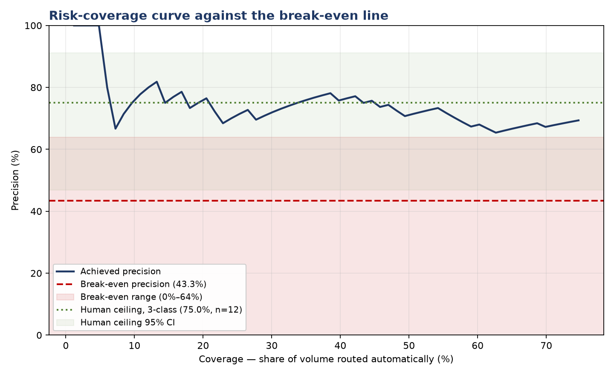

# Abeyance

**An AI feasibility and evaluation programme for consumer complaint triage. It concluded that the system should not be built, and measured exactly why.**

[Live console](https://abeyance.vercel.app) · [Findings](docs/10_findings.md) · [Governance](docs/21_governance.md) · [Evidence](https://abeyance.vercel.app/evidence)



---

## The short version

The CFPB publishes 16.9 million consumer complaints. Every one carries an issue category chosen by the person filing it from a list of 89, and every system downstream treats that category as fact.

I labelled 100 of them by hand against the statute.

| | |
|---|---|
| Intake issue label agrees with expert reading | **46.0%** |
| Intake product label agrees | 85.0% |
| Issue disagreements inside one three category cycle | **38 of 54** |
| Best separation from fourteen lexical signals | **0.33** |
| Complaints judged unresolvable by any rule | **1 in 6** |

Twelve candidate interventions were then assessed, three recommended, and two built.

| | Keyword | LLM direct | Tournament | Largest class |
|---|---|---|---|---|
| Accuracy | 47.0% | 51.8% [49.4, 54.2] | 44.6% | **61.4%** |
| Macro F1 | 0.471 | **0.549 [0.525, 0.571]** | 0.488 | not applicable |
| Abstention precision | none | 23.8% [16.7, 23.8] | 29.2% | not applicable |

**None beats always guessing the largest class on accuracy.** The macro F1 advantage over the keyword baseline is the only system comparison in this programme that survives its own error bars.

And the comparison between the two AI approaches **cannot be settled with this study**. The abstention effect carries p = 0.218 at 28% statistical power, and re running the identical prompt moves the key metric by 12.5 points. Reporting 29.2% against 23.8% as an improvement would have been the natural mistake.

---

## Why this exists

Most portfolio projects report an intervention working. This one pre registered two hypotheses, measured both, found neither held, and then quantified what a conclusive test would cost.

Four results I did not expect going in.

**The taxonomy boundary is not lexical.** The word *permission* is the legal definition of improper use. It appears in 36% of cases labelled that way and 18% of cases labelled something else. The same vocabulary appears in every class but in different syntactic roles, naming the grievance in one and the requested remedy in another. Pattern matching cannot see role.

**Zero Condorcet cycles.** Intervention 2 assumed a genuinely ambiguous narrative would produce intransitive pairwise judgements. In 83 cases the model was always transitive, including on all 16 cases a human judged two headed. The mechanism the intervention was built on does not exist in this data.

**Human confidence was calibrated. Model confidence was not.** On a blind relabel, mean self rated confidence was 2.58 on cases reproduced and 1.83 on cases that changed. The same elicitation from the model produced a number that looked like confidence and did not behave like one.

**My own reported figure was a lucky draw.** The abstention precision recorded as 23.8% turned out to be the best of three runs. The mean is 21.1%. I had a finding for about a day before the variance check took it away.

---

## The console

A decision console at [abeyance.vercel.app](https://abeyance.vercel.app). Paste a complaint; the system states three competing legal theories, tests each against the narrative, and shows the work.

Two theories surviving means the decision is **withheld** and the case goes to a person. The refusal is the output, not a fallback.

For routed cases it drafts an acknowledgment letter and runs four deterministic controls over it:

| Control | Prevents |
|---|---|
| Every citation was retrieved | Citing a provision from training data rather than context |
| No figure absent from the source | Inventing a deadline that sounds plausible |
| All five required elements present | An acknowledgment missing the case reference or timeline |
| No commitment before investigation | Promising removal, conceding fault, asserting a violation |

Three of those patterns exist **only because a red team attack got through an earlier version**. The controls run downstream of generation, which is why an injection that successfully steered the model still produced a caught output.

---

## Reading order

Start with **[`docs/10_findings.md`](docs/10_findings.md)**. It is the study end to end, including the limitations.

| | Document | What it establishes |
|---|---|---|
| 04 | [Label noise](docs/04_label_noise.md) | 46% agreement; the three category cycle |
| 05 | [Boundary cases](docs/05_boundary_cases.md) | Fourteen lexical signals tested; none separates |
| 06 | [Annotation guideline](docs/06_annotation_guideline.md) | The counterfactual test; the abstention criterion |
| 07 | [Keyword baseline](docs/07_baseline.md) | Pre registered failure, confirmed |
| 08 | [LLM classifier](docs/08_llm.md) | Intervention 1; abstention does not work |
| 09 | [Pairwise tournament](docs/09_tournament.md) | Intervention 2; zero cycles |
| **10** | **[Findings](docs/10_findings.md)** | **The study** |
| 11 | [Variance](docs/11_variance.md) | Three runs; one result does not survive |
| 12 | [BRD](docs/12_brd.md) | Ten requirements traced to findings |
| 13 | [RTM and UAT](docs/13_rtm_uat.xlsx) | Traceability matrix and test cases |
| 14 | [Reliability](docs/14_reliability.md) | Intra rater agreement, stratified by contamination |
| 15 | [Opportunity assessment](docs/15_opportunity_assessment.md) | Twelve interventions scored on seven dimensions |
| 16 | [Recommendation memo](docs/16_recommendation_memo.md) | Two pages, executive register |
| 17 | [Cost model](docs/17_cost_model.md) | Break even precision and the shadow price of a misroute |
| 18 | [Draft generation](docs/18_draft_generation.md) | Intervention 3; four groundedness controls |
| 19 | [Judge validation](docs/19_judge_validation.md) | The judge measured before it was used |
| 20 | [Red team](docs/20_redteam.md) | Nine attacks, six caught, one unmitigated |
| 21 | [Governance](docs/21_governance.md) | Model card, failure taxonomy, monitoring, rollback |

**Phase 1 is reproducible rather than written up.** The corpus census, the taxonomy
drift analysis and the scoping decision are produced by
[`src/profile_corpus.py`](src/profile_corpus.py),
[`src/taxonomy_drift.py`](src/taxonomy_drift.py) and
[`src/scoping_decision.py`](src/scoping_decision.py), with the resulting category
list in [`docs/taxonomy_reference.md`](docs/taxonomy_reference.md). Their findings
are stated in §1 of the findings document: 16,872,860 complaints, 3,830,206
carrying a narrative, three rename chains traced, and the window locked at
25 August 2023.

---

## Three findings worth the click

### The assessment recommended against its own highest value candidate

Twelve interventions were scored on seven weighted dimensions with written anchors. Candidate 11, full autonomous resolution, scores **5 on value at stake, the highest in the portfolio, and 1.95 overall, the lowest**.

An assessment ranking on value alone builds it first. Its failure mode is not a mislabelled complaint; it is a consumer receiving an incorrect resolution to a financial dispute that no person read.

Scoring model in [`docs/scoring_model.xlsx`](docs/scoring_model.xlsx), live and auditable. Change a weight and all twelve scores recalculate.

### Cost is the wrong criterion, and the model proves it

Break even precision is **43.3%**, and every system built clears it. That result is arithmetically correct and operationally wrong.

Break even sits far below the 75.0% human ceiling because automation removes six minutes of reading labour from every case. A system can be substantially worse than a person and still be cheaper.

So the recommendation is not a threshold. It is a question, in a form someone can answer:

> Is a misrouted consumer complaint worth more or less than **$38.27** to this organisation?

### One failure has no detection method

A draft can be fluent, correctly cited, properly scoped, free of invented figures, and about a complaint the consumer never made. Every individual property it asserts is well formed, so no deterministic check catches it.

The LLM judge was tested on exactly this case and answered that the draft did restate the grievance. It detects the **absence** of a restatement but not the **incorrectness** of one. Recorded as unmitigated in [`docs/21_governance.md`](docs/21_governance.md) §2, failure D8.

---

## Method notes

**Pre registration.** The keyword baseline was declared a predicted failure in the annotation guideline, with the reason stated, before it was built.

**Leakage control.** No few shot examples were drawn from the evaluation set. The ambiguity flags were never shown to any model, because whether a model abstains where the guideline says it should is the measurement and cannot be an input.

**Reproducibility.** Every API response is cached to JSONL. Re scoring with `--offline` reproduces published numbers exactly. The model accepts no temperature parameter, so variance was measured across three independent caches rather than assumed away.

**Disclosed protocol deviation.** The blind relabel was meant to run 48 hours after the first pass. It ran the same day, and 8 of 25 cases had been re read hours earlier with labels visible. The analysis is stratified: 70.6% on the clean stratum against 87.5% on the anchored one, an anchoring effect of **+16.9 points**, which is itself a usable result about annotation protocol.

**Guards that earned their place.** Three separate times a measurement in this project turned out to be a defect rather than a finding: a lexical signal that matched zero narratives, a required elements check that failed 20 out of 20, and a fabrication check blind to spelled out numbers. Each is now caught automatically. A check that never fires in either direction prints a warning telling you not to report it.

---

## Honest limitations

- Intra rater reliability is 70.6%, 95% CI [46.9%, 86.7%]. The lower bound clears the 46.0% comparison by **0.9 percentage points**. The direction holds; the precision does not.
- Single labeller throughout. Inter rater reliability with a second person would be the stronger test.
- 14 of 89 issues have sample support and nine classes sit at n=1. Conclusions apply to the three dominant credit reporting categories and nothing else.
- Intervention 2 was run once and has no variance estimate. Its apparent advantage carries the same single draw risk the variance check exposed in Intervention 1.
- No demographic disaggregation is possible; the corpus carries no protected characteristic fields. This is a limitation, not a clearance.
- A conclusive comparison needs roughly 400 labelled cases **and** repeated runs of each system.

---

## Running it

```bash
python -m venv venv && source venv/bin/activate     # venv\Scripts\activate on Windows
pip install duckdb pandas scipy openpyxl matplotlib anthropic

python 04_label_noise_analysis.py --golden human_ceiling_sample_labelled.csv \
    --parquet data/raw/complaints.parquet --outdir docs/
python 05_boundary_analysis.py   --golden golden_set_v2.csv \
    --disagreements docs/04_disagreements.csv --outdir docs/
python 07_baseline_keyword.py    --golden golden_set_v2.csv --outdir docs/

export ANTHROPIC_API_KEY=...
python 08_llm_classifier.py      --golden golden_set_v2.csv --outdir docs/
python 09_pairwise_tournament.py --golden golden_set_v2.csv --outdir docs/
python 11_variance_check.py      --golden golden_set_v2.csv --outdir docs/
python 17_cost_model.py          --outdir docs/ --coverage docs/08_risk_coverage.csv
python 18_draft_generation.py    --golden golden_set_v2.csv --outdir docs/ --n 20
python 19_llm_judge.py --human docs/19_human_labels.csv --outdir docs/
python 20_red_team.py --outdir docs/ --judge-live --live
python 14_reliability.py --relabel blind_relabel_25.csv \
    --key blind_relabel_25_KEY_DO_NOT_OPEN.csv --outdir docs/
```

Steps 08, 09, 11, 18, 19 and 20 call the API. Total cost is well under a dollar, and caching makes a second run free.

**Data.** CFPB Consumer Complaint Database, 8.6 GB CSV converted to Parquet via DuckDB. Not committed to this repository. Download from [consumerfinance.gov](https://www.consumerfinance.gov/data-research/consumer-complaints/).

### The console

```bash
cd console
npm install
cp .env.example .env.local        # add ANTHROPIC_API_KEY
npm run dev
```

The key is read server side in `app/api/triage/route.js` and never reaches the browser.

---

## Stack

Python 3.13 · DuckDB · pandas · scipy · matplotlib · openpyxl · Anthropic API · Next.js · Vercel

## Licence

MIT for the code. The CFPB Consumer Complaint Database is public domain.
