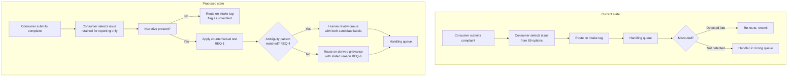

# 12 — Business Requirements Document

**Automated issue triage for consumer credit-reporting complaints**

| | |
|---|---|
| Document | BRD v1.0 |
| Author | Sivakumar Reddy Yenna |
| Date | August 2026 |
| Status | Draft for review |
| Evidence base | `10_findings.md`, `11_variance.md` |

---

## 1. Purpose

To define business requirements for a system that routes incoming consumer
credit-reporting complaints to the correct handling queue, and to record the
constraints that the feasibility study in `10_findings.md` established as
binding on any such system.

This document does not propose a build. Section 9 states the conditions that
must be met before a build decision can be made.

---

## 2. Background and problem statement

Complaints arrive with an issue category selected by the consumer from an
89-option list at intake. Downstream routing, staffing, and reporting all treat
that selection as the complaint's type.

**The selection is unreliable.** Measured against expert reading of 100 sampled
narratives, the intake issue tag matches 46% of the time. Product selection is
sound at 85%; the failure is specific to the issue taxonomy.

The disagreement is concentrated, not diffuse. 38 of 54 issue disagreements fall
among three categories — *Incorrect information on your report*, *Improper use of
your report*, and *Problem with a company's investigation into an existing
problem* — and flow in both directions on every edge between them.

**Business impact.** If routing follows the intake tag, roughly half of
credit-reporting complaints reach a queue selected on an unreliable signal.
Because these three categories are also the highest-volume ones, the error
concentrates where volume is greatest.

---

## 3. Objectives

| ID | Objective | Measure |
|---|---|---|
| OBJ-1 | Route complaints on the grievance actually described, not the intake tag | Agreement with expert reading on a held-out sample |
| OBJ-2 | Identify complaints that cannot be routed automatically and send them to human review | Proportion of genuinely ambiguous complaints correctly withheld |
| OBJ-3 | Avoid encoding the intake artefact into an automated system | Model not trained or scored against intake labels |
| OBJ-4 | Make routing decisions auditable | Every automated decision carries a stated reason |

---

## 4. Scope

**In scope**
- Credit-reporting complaints containing a free-text narrative
- The three-category classification defined in `06_annotation_guideline.md`
- An abstention path to human review

**Out of scope**
- The remaining 12 products. The study sampled 19 such cases in total and draws no conclusions about them.
- The full 89-issue taxonomy. Sample support exists for 14 issues, nine of them at n=1.
- Any change to the consumer-facing intake form. Redesigning the issue picker may well be the higher-value intervention, but it is a separate initiative.

---

## 5. Process model

Current and proposed states. The proposed state adds one decision gate and one
queue; it does not replace human handling.

The decision gate at **B5** is a rule, not a model confidence threshold. Section
6 explains why.

---

## 6. Business requirements

| ID | Requirement | Priority | Source |
|---|---|---|---|
| REQ-1 | The system shall determine the primary grievance by applying the counterfactual test: remove the alleged defect and assess whether a complaint remains. | Must | `06_annotation_guideline.md` §2 |
| REQ-2 | The system shall not be trained on, or scored against, consumer-selected intake issue labels. | Must | `10_findings.md` §2 — 46% agreement |
| REQ-3 | The system shall classify into the three-category set only, and shall not attempt the 89-issue taxonomy. | Must | `10_findings.md` §1 — 14 of 89 issues have sample support |
| REQ-4 | The system shall withhold a routing decision where any of the three documented ambiguity patterns is present, and send the complaint to human review. | Must | `06_annotation_guideline.md` §3 |
| REQ-5 | The abstention decision shall be made by documented rule, not by model-reported confidence. | Must | `10_findings.md` §5.2 — abstention concentration sits inside sampling noise |
| REQ-6 | Every automated routing decision shall record which defect, if removed, would end the complaint. | Must | OBJ-4 |
| REQ-7 | Complaints without a narrative shall route on the intake tag and be flagged as unverified. | Should | Scope §4 — 77.3% of complaints have no narrative |
| REQ-8 | The human review queue shall present both candidate labels and the reason the system declined to choose. | Should | OBJ-2 |
| REQ-9 | The system shall retain the intake tag unchanged for continuity of historical reporting. | Should | Stakeholder continuity |
| REQ-10 | Any performance claim shall be reported with a range across at least three independent runs. | Must | `11_variance.md` — reported figures varied by up to 12.5 points between runs |

---

## 7. Assumptions

| ID | Assumption | If false |
|---|---|---|
| ASM-1 | The hand labels are the more reliable side of the 46% disagreement. | The entire business case inverts. **Verified marginally**: 70.6% self-agreement, 95% CI [46.9%, 86.7%], against 46.0%. The lower bound clears by 0.9 points. Direction holds; precision does not. |
| ASM-2 | The three-category structure generalises beyond the 100-case sample. | Requirements REQ-3 and REQ-4 need re-derivation on a larger sample. |
| ASM-3 | Human reviewers can resolve cases the system withholds. | The abstention path adds cost without adding accuracy. |
| ASM-4 | Narrative availability stays near 22.7%. | REQ-7's coverage changes materially. |

---

## 8. Constraints

- **Label noise floor.** No system scored against intake labels can exceed ~50% agreement without learning the intake artefact rather than the grievance.
- **No lexical solution exists.** Fourteen signals were tested; maximum separation was 0.33. Rule-based keyword routing is ruled out on evidence, not preference.
- **Evaluation is expensive.** Distinguishing candidate approaches requires roughly 400 labelled cases *and* repeated runs of each. A single-run comparison on 83 cases cannot separate them.
- **Model output varies between runs.** Macro-F1 moved 0.046 and abstention rates 12.5 points across three identical runs.

---

## 9. Conditions for a build decision

This document does not recommend proceeding. Three conditions must be met first.

| # | Condition | Status |
|---|---|---|
| 1 | Intra-rater reliability measured on a blind re-label, establishing ASM-1 | **Met, marginally** — 70.6% [46.9%, 86.7%], n=17. Should be re-measured on a larger sample with a proper time gap before a build commitment. |
| 2 | Golden set expanded to ~400 cases with ~75 ambiguous, for 85% statistical power | Not started |
| 3 | Candidate approaches compared across at least three runs each | Partially met — Intervention 1 only |

Proceeding without condition 1 would build on an unverified premise. Proceeding
without conditions 2 and 3 would mean selecting an approach on evidence the
study has already shown to be insufficient.

---

## 10. Traceability

Requirements trace to findings and to test cases in `13_rtm_uat.xlsx`.
